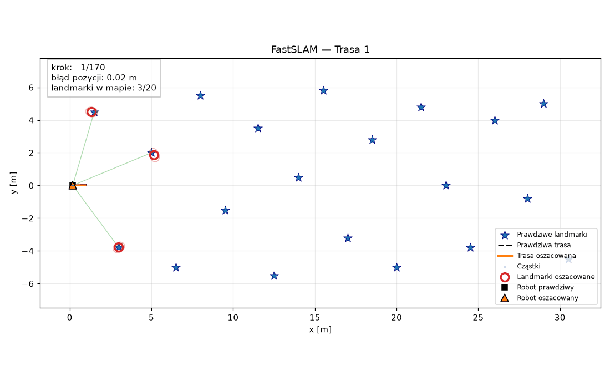

# FastSLAM PGM Robotics

[](LICENSE)
[](https://www.python.org/)
[](https://numpy.org/)

An educational implementation of **FastSLAM 1.0** for simultaneous localization and mapping (SLAM) in a two-dimensional environment.

The project simulates a mobile robot equipped with noisy odometry and a range-bearing sensor. The robot estimates its trajectory while building a map of point landmarks using a Rao–Blackwellized particle filter:

- a **particle filter** represents possible robot trajectories,
- a separate **Extended Kalman Filter (EKF)** estimates each landmark inside every particle.

The implementation is based on the paper:

> M. Montemerlo, S. Thrun, D. Koller, and B. Wegbreit,  
> *[FastSLAM: A Factored Solution to the Simultaneous Localization and Mapping Problem](https://cdn.aaai.org/AAAI/2002/AAAI02-089.pdf)*, AAAI, 2002.


## Requirements

This project was developed and tested with `Python 3.14.3`.

All required Python packages are listed in `requirements.txt`.


## Usage

Install the dependencies:

```bash
pip install -r requirements.txt
```

### Running the Simulation

```bash
# for route 1 — smooth curve
python main.py --route trasa1

# for route 2 — slalom
python main.py --route trasa2
```

### Useful command-line options

```bash
# Run without the live window:
python main.py --route trasa1 --no-live

# Run without creating a GIF:
python main.py --route trasa1 --no-gif
```


## Demo

<table>
  <tr>
    <td align="center">
      <strong>Route 1 — Smooth curve</strong>
    </td>
    <td align="center">
      <strong>Route 2 — Slalom</strong>
    </td>
  </tr>
  <tr>
    <td align="center">
      
    </td>
    <td align="center">
      
    </td>
  </tr>
</table>

The generated trajectory and landmark visualizations, as well as the GIF animations, are saved automatically in route-specific directories:

```text 
outputs/ 
├── trasa1/ 
└── trasa2/
```

The simulation can also be displayed live in a Matplotlib window.


## Example Results

The following results were obtained using the default simulation configuration and random seed:

| Metric | Route 1 | Route 2 |
|---|---:|---:|
| Mean robot-position error | 0.232 m | 0.041 m |
| Final robot-position error | 0.519 m | 0.028 m |
| Mean map RMSE | 0.205 m | 0.073 m |
| Final map RMSE | 0.314 m | 0.044 m |
| Mapped landmarks | 20 / 20 | 20 / 20 |
| Resampling operations | 99 | 97 |

The slalom route produces better results in this simulation because the robot observes landmarks from more diverse positions and angles.


## Implementation Scope

This repository implements the main idea of FastSLAM 1.0 in a simplified educational environment.

Current assumptions and limitations:

- landmark correspondences are known,
- landmarks are static points in a two-dimensional environment,
- motion and measurement noise are modelled using Gaussian distributions,
- the balanced-tree optimization described in the original paper is not implemented,
- the project is intended for education and simulation rather than direct deployment on a physical robot.


## 📜 License

This project is licensed under the **MIT License**. See the [LICENSE](LICENSE) file for details.